# State flows, table by table

This page explains, in plain language, every column in the API that tracks a state. Reviewed against the code on 2026-09-28, after migration 024 (024 only adds `ask_history`, which has no state machine): the planner confirms a request and later submits the recomputed draft, the system checks covenants on submission, a controller approves, the CFO locks, and the system publishes. There is no "back to draft".

For each table you'll find:

- the **states** it can be in, what each one means, and who or what sets it;
- a **diagram** of how it moves between states;
- the **rules** the database or the code enforces.

The diagrams are Mermaid; they render on GitHub and in VS Code's Markdown preview (Ctrl+Shift+V). Code links point at the file and line as of this review, so exact numbers may drift as the code changes — the file name is the reliable part.

**Two ways to start a re-forecast, one workflow underneath.**

- **Question-driven (the page people use).** A planner types a question in plain words. The agent drafts a `reforecast_request`; the **planner confirms** it, which starts the workflow; the workflow recomputes only the affected lines into a DRAFT version; the **planner reviews those lines and submits**; the **system checks the covenants** (a breach rejects the draft there and then); a **controller approves** (or rejects); the **CFO locks**; the **system publishes** and commits.
- **Manual (API only, not shown in the UI).** `POST /api/v1/reforecast` with a driver value directly. Same three human gates and the same automated covenant check on submission (measured on the whole plan); nobody records a re-forecast's covenant by hand. This path stays alive for tests, recorded test histories, and `make reforecast`.

**Who does what** (the requested RBAC design; the assignment's own rule is that approval is by a second user):

| Step | Who | Moves |
|---|---|---|
| Confirm the agent's draft | the planner who asked | request PROPOSED → RUNNING |
| Review the recomputed lines, submit | a planner | (draft stays DRAFT until the check) |
| Covenant check | the system only | DRAFT → IN_REVIEW on a pass, DRAFT → REJECTED on a breach |
| Approve or reject | a controller, not the requester | IN_REVIEW → APPROVED / REJECTED |
| Lock, or decline | the CFO, not the requester and not the approver | APPROVED → LOCKED / REJECTED |
| Publish, commit, variance | the system, only once LOCKED | cube + Commitment Service |

| # | Table (schema) | State column |
|---|---|---|
| 1 | [`plan_version`](#1-plan_version-fpa_governance) (fpa_governance) | `state` (+ the `covenant_ok` flag) |
| 2 | [`reforecast_request`](#2-reforecast_request-fpa_governance) (fpa_governance) | `state` |
| 3 | [`covenant_check`](#3-covenant_check-and-covenant_rule-fpa_governance) (fpa_governance) | `passed` (+ `covenant_rule.active`) |
| 4 | [`plan_approval`](#4-plan_approval-fpa_governance) (fpa_governance) | `decision` |
| 5 | [`recompute_run`](#5-recompute_run-fpa_governance) (fpa_governance) | `state` and `phase` |
| 6 | [`plan_publication`](#6-plan_publication-fpa_governance) (fpa_governance) | `state` |
| 7 | [`commitment`](#7-commitment-commitment_service) (commitment_service) | `state` |
| 8 | [`variance_report`](#8-variance_report-fpa_governance) (fpa_governance) | `status` |
| 9 | [`agent_proposal`](#9-agent_proposal-fpa_governance) (fpa_governance) | `state` |
| 10 | [`plan_driver`](#10-plan_driver-fpa_governance) (fpa_governance) | `status` |
| 11 | [`scenario_set`](#11-scenario_set-fpa_governance) (fpa_governance) | `state` |

ClickHouse (`fpa_cube`) doesn't have a state column at all. Instead, each plan row carries a `revision` number, and `fact_plan_line` always keeps the highest revision for each key. What each revision means is recorded in `plan_publication` (table 6).

---

## 1. `plan_version` (fpa_governance)

One row per plan version — the original plan (`PV-2026-0001`) and every re-forecast made from it (`PV-2026-0001-R2`, `-R3`, …).

**Possible values:** CHECK `ck_plan_version_state` ([004:53](../db/migrations/versions/004_create_plan_versions_and_scenarios.py#L53)). Starts as `DRAFT`.
**Which moves are allowed for people:** listed in `plan_state_transition`, seeded from [db/seed.yaml](../db/seed.yaml).

| State | What it means | Who/what sets it | Code |
|---|---|---|---|
| `DRAFT` | Being written, nobody's been asked yet. For a re-forecast: the recomputed lines, waiting for the planner to review and submit them | Someone creates a draft (`POST /plan-versions`); or the worker, when it creates a re-forecast | [governance.py](../src/fpa_project/governance.py), `ensure_target_version` |
| `IN_REVIEW` | Submitted, waiting for a controller | A planner submits an original plan; for a re-forecast, the system after the planner submits **and** every covenant check passes (`open_review`) | [governance.py](../src/fpa_project/governance.py), [activities.py](../src/fpa_project/recompute/activities.py) |
| `APPROVED` | A controller agreed; `approved_by` is filled in. **Not locked, not published** | A controller approves (`record_approval` for a re-forecast) | same |
| `LOCKED` | Final — nothing on this row, or its lines, can change. Only now can it publish | The CFO locks it (`record_lock` for a re-forecast) | same |
| `REJECTED` | Turned down, **for good** (there is no way back to DRAFT) | A controller rejects (IN_REVIEW); the CFO declines to lock (APPROVED); or the worker, on a covenant breach at submission, the 72-hour timeout, a cancel, or a failed run | same |
| `SUPERSEDED` | Replaced by a newer version. As frozen as LOCKED | The worker, when a re-forecast commits: the source plan and every earlier LOCKED re-forecast of it. Or a planner by hand: from APPROVED, or from LOCKED once a LOCKED re-forecast of it exists | [activities.py](../src/fpa_project/recompute/activities.py) `_supersede_versions`, [governance.py](../src/fpa_project/governance.py) |

```mermaid
stateDiagram-v2
    [*] --> DRAFT : Create draft (human)\nor the worker creates PV-…-R&lt;n&gt;
    DRAFT --> IN_REVIEW : Submit (planner); for a re-forecast,\nonly once the system's covenant check passes
    DRAFT --> REJECTED : the worker: covenant breach on submission,\ntimer, cancel or failure
    IN_REVIEW --> APPROVED : Approve (controller)\nneeds covenant_ok = true, not the requester
    IN_REVIEW --> REJECTED : Reject (controller)\nor the worker: timer / cancel
    APPROVED --> LOCKED : Lock (cfo), not the approver\nthe system then publishes
    APPROVED --> REJECTED : Do not lock (cfo)\nor the worker: timer / cancel
    APPROVED --> SUPERSEDED : Mark superseded (planner)
    LOCKED --> SUPERSEDED : a newer re-forecast committed (worker)\nor planner, once a LOCKED successor exists
    LOCKED --> [*]
    SUPERSEDED --> [*]
    REJECTED --> [*]
```

**The `covenant_ok` flag** (a yes/no on the same row — it's a flag, not a state):

| Value | What it means | Who/what sets it | Code |
|---|---|---|---|
| `false` | Not confirmed yet. This is the default, including for new re-forecasts | Creating a draft; the worker | [governance.py](../src/fpa_project/governance.py), [activities.py](../src/fpa_project/recompute/activities.py) |
| `true` (by a person) | **Original plans only:** a controller recorded a pass by hand | `PUT /plan-versions/{code}/covenant` | [governance.py](../src/fpa_project/governance.py) |
| `true` (automated) | **Re-forecasts:** every covenant check on the submitted draft passed. No role can write this by hand (migration 023) | The worker's covenant check on submission | [activities.py](../src/fpa_project/recompute/activities.py) |

**Rules:**
- **Covenant gate:** you can't reach APPROVED or LOCKED unless `covenant_ok = true`.
- **Approver recorded:** you can't reach APPROVED or LOCKED without `approved_by` filled in.
- **Who can set `covenant_ok`:** on a re-forecast, only the service, and only when every `covenant_check` row for that version passed — a controller, CFO or anyone else is refused, even with a database connection (migration 023). On an original plan (nothing recomputed for the system to measure), a controller records it by hand.
- **Approved is not locked:** approving does not lock or publish. The CFO locks; the person who approved cannot also lock.
- **No back to draft:** there is no REJECTED → DRAFT transition. A rejected version stays rejected; a new change is a new version.
- **A re-forecast moves only through its run:** `POST /plan-versions/{code}/transition` refuses to submit, approve, lock or reject a re-forecast; only its run's gates do (SUPERSEDED excepted).
- **Locked means locked:** once a row is LOCKED or SUPERSEDED, nobody can insert, update, or delete it or its lines. The one exception (migration 016): LOCKED → SUPERSEDED, changing the state and nothing else, and only when a LOCKED successor in the same line exists.
- **No pass over a failed check:** if the automated covenant check recorded a failure for a version, nobody — controller included — can set `covenant_ok = true` on it.
- **No self-approval:** the person approving can't be the person who asked.
- **The original plan's numbers never change:** a re-forecast writes a new version that points back to it. When that re-forecast commits, the original becomes SUPERSEDED (its lines untouched), so the state says which version is current and `supersedes_plan_version_id` gives the chain.

### Plan lines: base scenario only, and a trace that explains

`plan_version_line` is the governed record, and migration 016 puts two rules on it:

- **Branches, not copies.** Only the base scenario's lines are stored. Stretch and downside are `scenario_set` rows whose `scenario_driver_override` values say how they differ; a line for either is refused (`plan_line_scenario_guard`). The cube's `fact_plan_line` still carries all three scenarios — that is the seeded, published projection, which the assignment forbids editing — and a re-forecast stages each branch's cube row as that branch's line × the same factors.
- **Every trace names its `driver`, `formula` and `inputs`** (`ck_plan_version_line_derivation_trace_explains`). A re-forecast line records its baseline quantity and price, each driver's formula with its before/after values and ratio, every binding (elasticity, ratio, factor) and the result. The seeded plan's base lines are imported with a `seeded_plan` trace (`db/import_plan_lines.py`) while the version is still DRAFT.

---

## 2. `reforecast_request` (fpa_governance)

A re-forecast a planner asked for in plain words, which the agent team turns into a draft. Added by [migration 015](../db/migrations/versions/015_reforecast_requests_and_covenant_checks.py).

**Possible values:** CHECK `ck_reforecast_request_state`. Starts as `PROPOSED`.

| State | What it means | Who/what sets it | Code |
|---|---|---|---|
| `PROPOSED` | Drafted by the agent, waiting for the planner to confirm it | The planner asks a question; the agent calls `propose_reforecast`; the API saves the draft under the planner's name | [app.py](../app.py), [reforecast_requests.py](../src/fpa_project/reforecast_requests.py) |
| `RUNNING` | Confirmed — the affected lines are being recomputed | The planner who asked confirms it (`POST /reforecast-requests/{id}/confirm`), starting the workflow | [app.py](../app.py) |
| `AWAITING_SUBMISSION` | Recomputed; the planner is reviewing the new lines | The run parks for the planner | [workflows.py](../src/fpa_project/recompute/workflows.py) |
| `COVENANT_FAILED` | The submitted draft broke a covenant. **Closed** — rejected before any controller saw it; nothing approved, published or committed | The system's covenant check on submission | same |
| `AWAITING_CONTROLLER` | Covenants passed, IN_REVIEW, waiting for a controller | The run parks for the controller | same |
| `CONTROLLER_REJECTED` | A controller rejected the submitted plan. **Closed.** | A controller (not the requester) | same |
| `AWAITING_CFO` | APPROVED, waiting for the CFO to lock it | The run parks for the CFO | same |
| `PUBLISHING` | LOCKED — the system is publishing and committing | The run | same |
| `PUBLISHED` | Live in the cube, and reserved in the ledger. **Closed.** | The run finishes | same |
| `CFO_REJECTED` | The CFO declined to lock it. **Closed.** | The CFO | same |
| `EXPIRED` | Nobody decided within 72 hours at one of the gates. **Closed.** | The run's timer | same |
| `CANCELLED` | Withdrawn before confirmation, or stopped before publishing. **Closed.** | The planner withdraws it; or someone cancels the run | [workflows.py](../src/fpa_project/recompute/workflows.py) |
| `COMPENSATED` | It published, then got rolled back because the Commitment Service failed. **Closed.** | The run's rollback | [workflows.py](../src/fpa_project/recompute/workflows.py) |
| `FAILED` | Something broke that couldn't be recovered. **Closed.** | The run | [workflows.py](../src/fpa_project/recompute/workflows.py) |

From `RUNNING` onward, this state is simply **copied from the run**: a database function works out what the request's state should be from the run's state, and a trigger applies it automatically. This means once a request starts running, nothing but the workflow itself can move it.

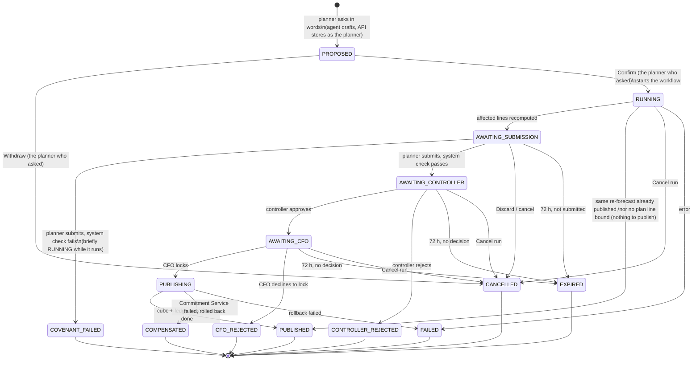

**Rules:**
- **Who can create one:** only a human planner, asking as themselves, and it always starts as PROPOSED.
- **Who confirms:** only the human planner who asked moves it from PROPOSED, to RUNNING (confirm) or CANCELLED (withdraw). No controller decides a proposed request: a controller's one decision is on the recomputed plan (migration 022).
- **The run is in charge from then on:** once RUNNING, any new state has to match what the run says — nothing else can mark a request covenant-failed or published.
- **Closed means closed:** every state marked **Closed** above is final. No reopening, no second decision.
- **What was asked stays fixed:** the driver, values, companies, months, question, evidence, and requester can't be edited, and rows can't be deleted.
- **Turning words into a draft:** the agent's desk (`ReforecastDesk.resolve`) does the translation — the driver must be ACTIVE with one fixed value, the country becomes the companies behind it (which must be in the planner's scope), the period becomes months of the plan year, and the starting value comes from the currently published plan for that exact slice.
- **Only planners get the tool:** the agent only offers `propose_reforecast` to a human planner with whole-model scope.
- **A rejection reads as whose it was:** a rejected run maps to COVENANT_FAILED if a check failed, CFO_REJECTED if the draft had already been approved, and CONTROLLER_REJECTED otherwise.
- **Old controller columns:** `controller_decided_by`, `controller_decided_at` and `controller_comment` are left over from before migration 022 and stay empty now; the controller decides on the plan version (table 4), not on the request.
- **One run per plan at a time:** starting a request while another run on the same plan is in progress is refused rather than merged in.

---

## 3. `covenant_check` and `covenant_rule` (fpa_governance)

`covenant_rule` holds the rules themselves as data; `covenant_check` holds one result per rule, per scenario, per run. Both were added by migration 015; the rules are seeded from [db/seed.yaml](../db/seed.yaml).

**The three seeded rules**, measured on the companies and months the request touches, in USD at plan FX rates:

| `rule_code` | Metric | How it's measured | Passes when |
|---|---|---|---|
| `GM_PCT_FLOOR` | gross margin % | recomputed level | ≥ 30 |
| `REVENUE_DROP_LIMIT` | services revenue | % change vs. the published plan | ≥ −5 |
| `DELIVERY_COST_CEILING` | delivery cost | % change vs. the published plan | ≤ +3 |

Each rule is checked against base, stretch, and downside scenarios, so one run writes 9 checks in total. `covenant_rule.active` turns a rule on or off.

**`covenant_check.passed`:**

| Value | What it means | Who/what sets it | Code |
|---|---|---|---|
| `true` | The measured value is within the limit | The worker's covenant check | [activities.py](../src/fpa_project/recompute/activities.py), [covenants.py](../src/fpa_project/recompute/covenants.py) |
| `false` | It isn't — or it couldn't be measured at all (for example, no revenue to take a margin of) | same | same |

```mermaid
stateDiagram-v2
    [*] --> evaluated : planner submits the recomputed draft
    evaluated --> all_passed : every check true
    evaluated --> any_failed : any check false
    all_passed --> [*] : covenant_ok = true (system), DRAFT → IN_REVIEW,\nrun parks for a controller
    any_failed --> [*] : submitted draft REJECTED, staged rows deleted,\nrequest COVENANT_FAILED; no controller asked
```

**When:** after the planner submits the recomputed draft, never before, and on every run. The planner reviews the lines first; the controller only ever sees a draft that passed.

**Rules:**
- **No person records it:** the verdict is the system's. A breach rejects the submitted draft on the spot; nobody can set a re-forecast's `covenant_ok` by hand (migration 023).
- **Checks can't be changed once written:** a retry finds the same rows already there and reads its answer from them instead of re-checking.
- **Rules are controller data:** only a controller can write or edit a rule.
- **Fails closed:** if there are no active rules, or no line for a rule to measure, the run fails rather than passing by default.

---

## 4. `plan_approval` (fpa_governance)

The controller's approval of a re-forecast. The row is only opened **after** the planner submits and the system's covenant check passes — so a breach never reaches a controller. The CFO's lock, or refusal to lock, is recorded on `plan_version` (LOCKED or REJECTED) and in the audit log, not here — so a row stays APPROVED even when the CFO then declines.

**Possible values:** CHECK `ck_plan_approval_decision` ([005:35](../db/migrations/versions/005_create_plan_approval.py#L35)). Starts as `PENDING`.

| State | What it means | Who/what sets it | Code |
|---|---|---|---|
| `PENDING` | Waiting for a controller | The system, when the submitted draft passes its covenant check (`open_review`) | [activities.py](../src/fpa_project/recompute/activities.py) |
| `APPROVED` | A controller approved — `decided_by` and `decided_at` are filled in | A controller (not the requester), with `covenant_ok = true` (`record_approval`, `make approve`) | same |
| `REJECTED` | Turned down | A controller (not the requester); or, under the system account, the 72-hour timeout, a cancel, or a failed run | same |

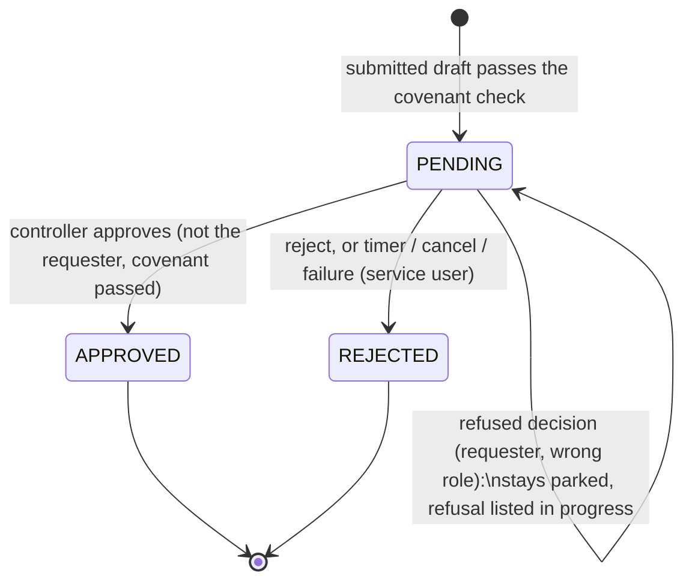

**Rules:**
- **The requester can't decide their own request.**
- **Approve and lock are two people:** the CFO also holds the controller role, so `record_lock` refuses a lock by the person who approved. (Migration 016's `plan_approval_separate_gates` still guards older rows whose request a controller started; since 022 no controller starts a request.)
- **A decision has to be complete:** PENDING has no decider; anything else needs `decided_by` and `decided_at` filled in.
- **Roles come from the transition table:** submitting needs DRAFT → IN_REVIEW (planner), approving IN_REVIEW → APPROVED (controller), locking APPROVED → LOCKED (cfo).

---

## 5. `recompute_run` (fpa_governance)

One row per re-forecast workflow run — a **copy** the workflow keeps up to date as it goes. The real source of truth is the Temporal workflow itself (`recompute-<plan code>`); this copy is best-effort and can lag slightly behind. A reforecast request mirrors this state (see table 2).

### 5a. `state`

**Possible values:** CHECK `ck_recompute_run_state` ([008:56](../db/migrations/versions/008_create_durable_recompute.py#L56), widened by [022](../db/migrations/versions/022_submit_approve_lock_gates.py#L35) with AWAITING_SUBMISSION and AWAITING_LOCK).

| State | What it means | When it's set | Code |
|---|---|---|---|
| `RUNNING` | Computing; later, checking covenants after submission | Set when the run opens, and refreshed at several points along the way | [activities.py](../src/fpa_project/recompute/activities.py), [workflows.py](../src/fpa_project/recompute/workflows.py) |
| `AWAITING_SUBMISSION` | Parked for the planner to review the recomputed lines and submit | The draft is saved | [workflows.py](../src/fpa_project/recompute/workflows.py) |
| `AWAITING_APPROVAL` | Parked for a controller. A refused decision leaves it here with the reason in `detail` | The covenant check passes | same |
| `AWAITING_LOCK` | Parked for the CFO | A controller approves | same |
| `PUBLISHING` | Locked — writing to the cube, then the Commitment Service | After the lock, through several internal steps | same |
| `COMPLETED` | Finished | Publish, commit, and variance all done — or the same re-forecast was already published — or nothing was bound to the driver | [workflows.py](../src/fpa_project/recompute/workflows.py) |
| `REJECTED` | Turned down. If it was the covenant check, `detail` starts with `COVENANT_BREACH:` and lists which rules failed | A covenant breach on submission, a controller's rejection, or the CFO declining to lock | [workflows.py](../src/fpa_project/recompute/workflows.py) |
| `EXPIRED` | Nobody decided within 72 hours | The timer | [workflows.py](../src/fpa_project/recompute/workflows.py) |
| `CANCELLED` | Stopped before publishing | Someone cancels it, or Temporal cancels it | [workflows.py](../src/fpa_project/recompute/workflows.py) |
| `COMPENSATED` | Published, then rolled back because the Commitment Service failed | Rollback succeeds | [workflows.py](../src/fpa_project/recompute/workflows.py) |
| `FAILED` | Unrecoverable error, or the rollback itself failed | Error past its retries | [workflows.py](../src/fpa_project/recompute/workflows.py) |

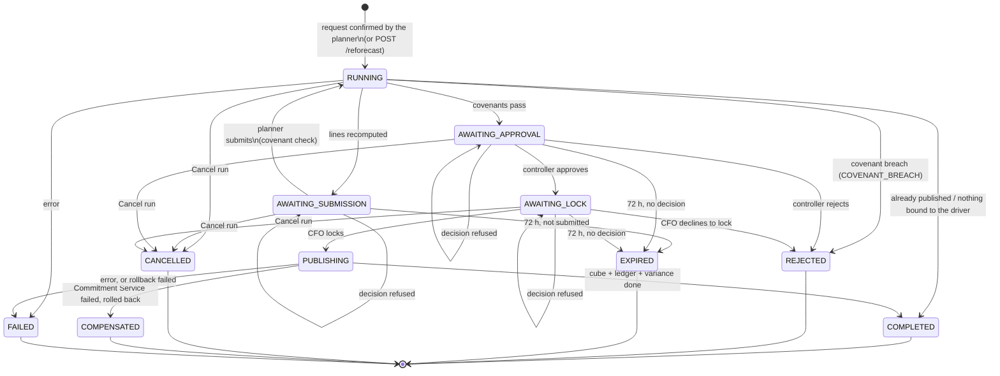

### 5b. `phase`

The step the workflow is currently on. Defined once in the code, plus `FAILED`. This column only updates when the state above is refreshed, so a couple of the phases below are only ever visible through the live progress query, not in the table.

| Phase | What happens |
|---|---|
| `STARTING` | The run opens |
| `SNAPSHOT` | A revision number is reserved, a successor plan version is created, the current plan is frozen as a baseline (once per plan), active drivers are read |
| `RESOLVING_DIRTY_SET` | Works out which plan lines the change actually touches |
| `RECOMPUTING` | Child workflows recompute those lines. Only lines inside the companies and months of the moves this run was asked for are read and rewritten; each still applies every move, committed ones included. Base lines go to Postgres (with their traces) and to the cube's staging table; stretch and downside go to staging only |
| `SAVING_DRAFT` | The child computations are done |
| `AWAITING_SUBMISSION` | Parked: the planner reviews the recomputed lines and submits |
| `COVENANT_CHECK` | After submission, every run: the system measures the covenant rules on the submitted draft |
| `AWAITING_APPROVAL` | Parked for a controller |
| `AWAITING_LOCK` | Parked for the CFO |
| `PUBLISHING` | Checks the successor is LOCKED, backs up the current rows, then copies the staged numbers live |
| `COMMITTING` | Posts the new commitments, then releases the previous revision's |
| `COMPENSATING` | Releases commitments and restores the cube from backup |
| `VARIANCE` | Writes a baseline-vs-re-forecast variance report per scenario |
| `DONE` | Every run ends here, success or not |
| `FAILED` | Something errored |

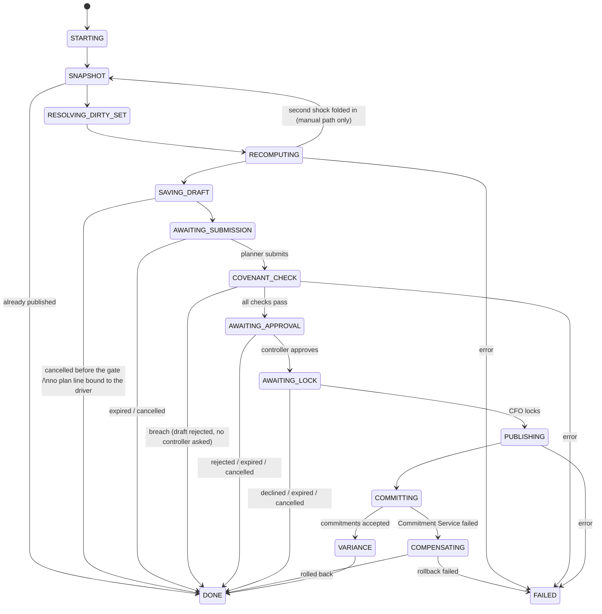

Only the most common error arrows are drawn: an error that exhausts its retries in any phase ends in `FAILED`. A refused decision at a gate keeps the phase where it is.

**Rules:**
- **A request's change is fixed:** a run started from a reforecast request refuses any second change part-way through.
- **The manual path allows one extra shock:** it can take one more change up to RECOMPUTING, but not once a person has the draft (AWAITING_SUBMISSION onward), and never a second change to a driver it's already moved.
- **Each park survives a worker restart:** the waits are Temporal timers and signals in the run's history. A decision sent while the worker is down is accepted (the API falls back to this table to know which gate is open) and applied when the worker returns.
- **Source plan must be settled:** a re-forecast needs its source plan to be APPROVED, LOCKED or SUPERSEDED (a plan already re-forecast once stays the key its line of re-forecasts hangs from).
- **Publish gate counts branches:** every scenario must have staged exactly as many rows as the approved base draft, because all branches share the base's keys.

---

## 6. `plan_publication` (fpa_governance)

One row per (source plan, revision): whether that revision's numbers actually reached the cube and the ledger.

**Possible values:** CHECK `ck_plan_publication_state` ([008:83](../db/migrations/versions/008_create_durable_recompute.py#L83), widened by [012:39](../db/migrations/versions/012_cumulative_reforecast.py#L39)). Starts as `RESERVED`.

| State | What it means | Who/what sets it | Code |
|---|---|---|---|
| `RESERVED` | The revision is claimed, but the numbers only exist in the staging table. A breached, rejected, cancelled, expired, or failed run leaves the row here | The run starts | [activities.py](../src/fpa_project/recompute/activities.py) |
| `PUBLISHED` | The numbers are copied into the live cube table | After the CFO's lock, only from RESERVED | [activities.py](../src/fpa_project/recompute/activities.py) |
| `COMMITTED` | The Commitment Service accepted every commitment | The commit step | [activities.py](../src/fpa_project/recompute/activities.py) |
| `COMPENSATED` | Commitments were released and the cube restored from backup | The rollback | [activities.py](../src/fpa_project/recompute/activities.py) |
| `COMPENSATION_FAILED` | The rollback failed and requires operator attention | Rollback exhausted its retries | [activities.py](../src/fpa_project/recompute/activities.py) |
| `SUPERSEDED` | An earlier committed revision whose commitments were released because a newer revision committed | The next revision's commit, only from COMMITTED | [activities.py](../src/fpa_project/recompute/activities.py) |

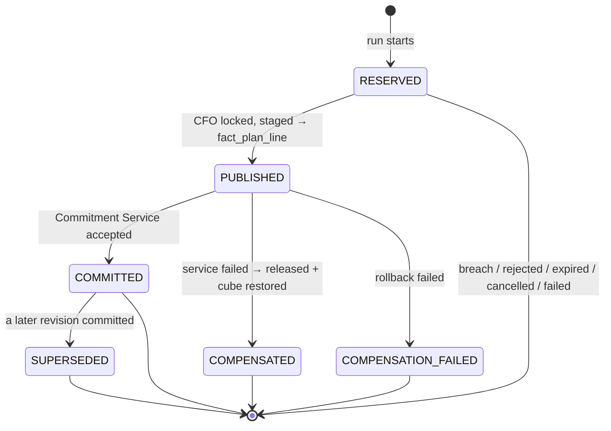

**Rules:**
- **The same change again:** if the same change is run a second time and finds this row already PUBLISHED or COMMITTED, the run ends COMPLETED without redoing anything.
- **Trying again after a dead end:** a row that's COMPENSATED, SUPERSEDED, or RESERVED-with-a-rejected-successor has its idempotency key retired (suffixed `:closed:<revision>`); the row itself keeps its state. Asking for the same change again then gets a fresh revision instead of reusing the stuck one.
- **Publish gate:** publishing needs the successor to be LOCKED and the staged row count to match the draft.
- **Scoped changes are remembered as scoped:** a whole-plan change is stored differently from a change scoped to specific companies and months, and the next re-forecast reapplies all of them.

---

## 7. `commitment` (commitment_service)

Budget reservations held by the separate Commitment Service (port 8100). This table has no CHECK constraint since the service owns it. Starts as `RESERVED`.

| State | What it means | Who/what sets it | Code |
|---|---|---|---|
| `RESERVED` | Budget held for one (revision, scenario, Revenue/Cost) combination | The commit step, `POST /commitments` — 6 per revision | [service.py](../src/fpa_project/commitment/service.py) |
| `RELEASED` | No longer held | Compensation, or a later revision superseding this one, via `DELETE /commitments/{id}` | [service.py](../src/fpa_project/commitment/service.py) |

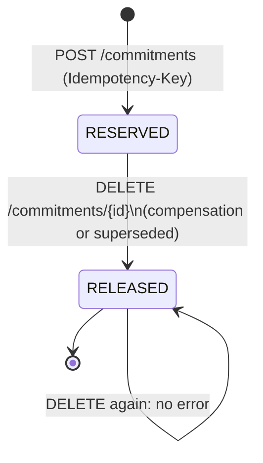

**Rules:**
- **Idempotency key:** built from a hash of the change, plus scenario and Revenue/Cost. Sending the same key again just returns the original commitment instead of creating a new one.
- **Amount:** the whole published plan for that scenario and line type, in USD at plan FX rates.

---

## 8. `variance_report` (fpa_governance)

A saved bridge: plan vs. actual (`POST /bridge`), or baseline vs. re-forecast (written during the VARIANCE phase).

**Possible values:** CHECK `ck_variance_report_status` ([010:39](../db/migrations/versions/010_variance_report_contract.py#L39)).

| Status | What it means | Who/what sets it | Code |
|---|---|---|---|
| `OPEN` | The gap is below the materiality threshold (250,000 USD) | Created by a bridge run or the worker; or moved here later | [bridge_service.py](../src/fpa_project/bridge_service.py), [activities.py](../src/fpa_project/recompute/activities.py) |
| `ESCALATED` | The gap is at or above the threshold | same | same |
| `INVESTIGATING` | Someone is looking into it | `POST /variance-reports/{id}/status` | [bridge_service.py](../src/fpa_project/bridge_service.py) |
| `REVIEWED` | It's been looked at | same | same |
| `CLOSED` | Done — `closed_by` and `closed_at` are filled in | same, by a controller or the CFO | same |

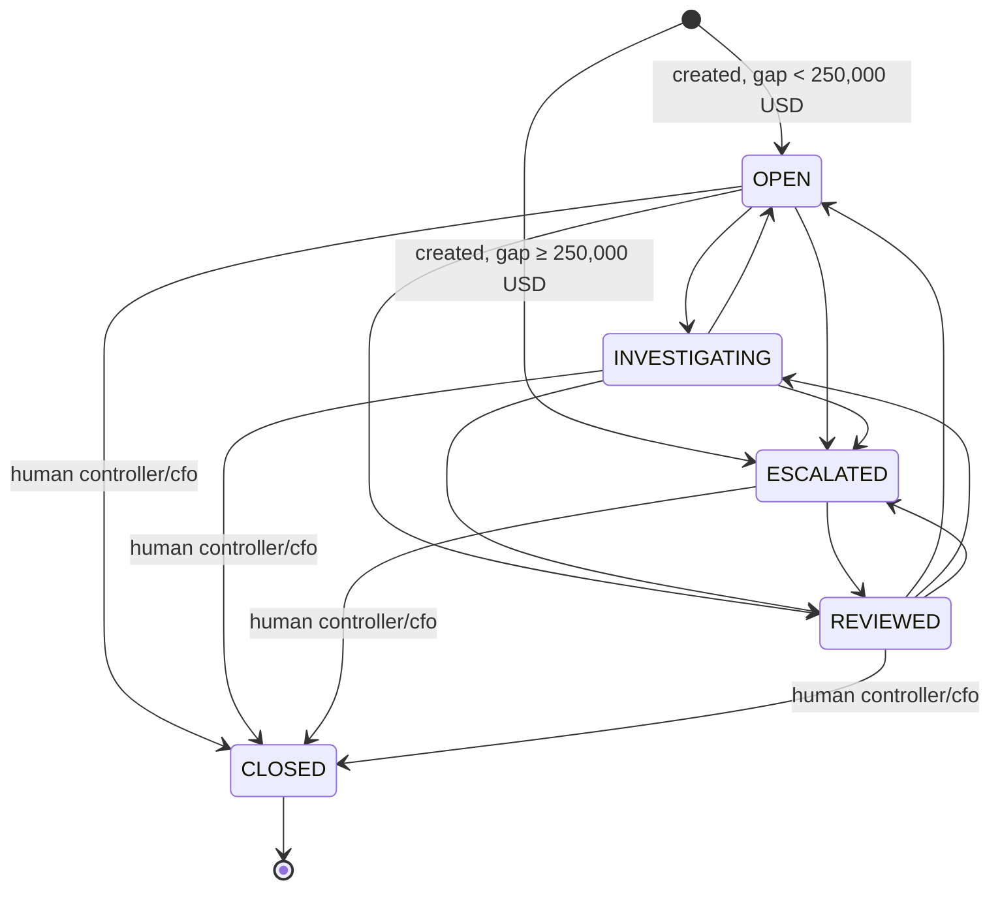

**Rules:**
- **Only a controller or the CFO can close a report.**
- **CLOSED is final** — a closed report never reopens.
- **No downgrading:** ESCALATED can never move back to OPEN or INVESTIGATING.
- **Everything else is free to move:** any other move among OPEN, INVESTIGATING, ESCALATED, and REVIEWED is allowed.
- **Scope check:** you can only change a report if every company it cites is in your own scope.

---

## 9. `agent_proposal` (fpa_governance)

A paused agent conversation that proposed a new driver **formula** (`propose_driver`). This is separate from a reforecast request (table 2), which changes a driver's **value**, not its formula.

**Possible values:** CHECK in [013:20](../db/migrations/versions/013_agent_proposals.py#L20). Starts as `PENDING`.

| State | What it means | Who/what sets it | Code |
|---|---|---|---|
| `PENDING` | The agent's run is paused on a draft formula | The agent calls `propose_driver`, and the pause is saved | [proposals.py](../src/fpa_project/agent_team/proposals.py) |
| `APPROVED` | A human accepted it, and the agent run continues | `POST /agent-proposals/{id}/decision` — a controller or CFO, not the asker. Not currently shown on the page | [proposals.py](../src/fpa_project/agent_team/proposals.py), [app.py](../app.py) |
| `REJECTED` | A human rejected it, and the agent run continues, told about the rejection | same endpoint | same |

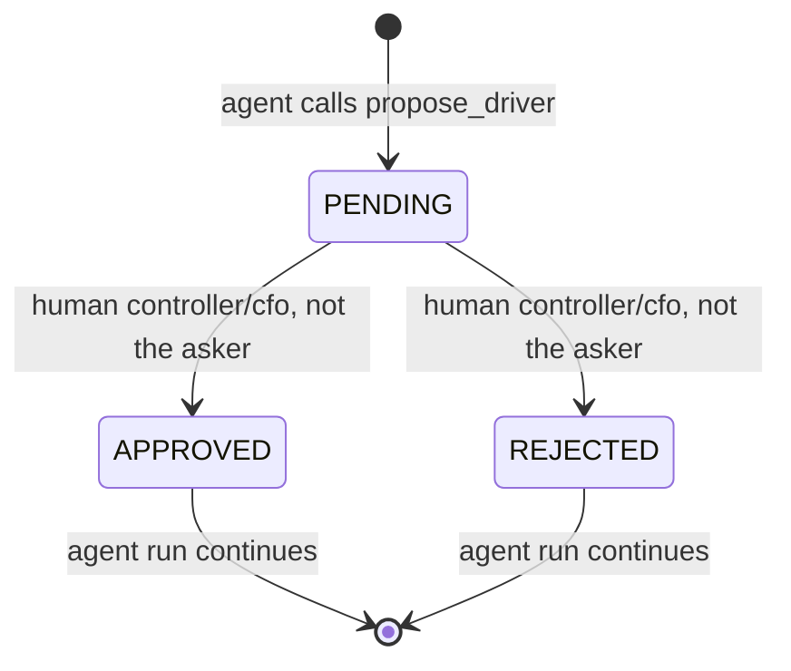

**Rules:**
- **Who decides:** only a human controller or CFO, as themselves — never the person who asked.
- **Final once decided:** it can't change after that.
- **What was proposed stays fixed:** the request, scope, drafts, and saved run can't be edited, and rows can't be deleted.
- **What approval actually does:** it only resumes the agent's conversation. It doesn't activate a driver or start a re-forecast by itself.

---

## 10. `plan_driver` (fpa_governance)

The drivers and their formulas.

**Possible values:** CHECK `ck_plan_driver_status` ([003:79](../db/migrations/versions/003_create_planning_model_registry.py#L79)). Starts as `ACTIVE` by column default.

| Status | What it means | Who/what sets it |
|---|---|---|
| `ACTIVE` | Usable — can be re-forecast | Seeded that way (12 drivers) |
| `DRAFT` | Saved and validated, but not yet usable in a re-forecast | Creating a new driver (`POST /drivers`) |
| `RETIRED` | Excluded from the model | **Reserved for future use — nothing in the code sets this today** |

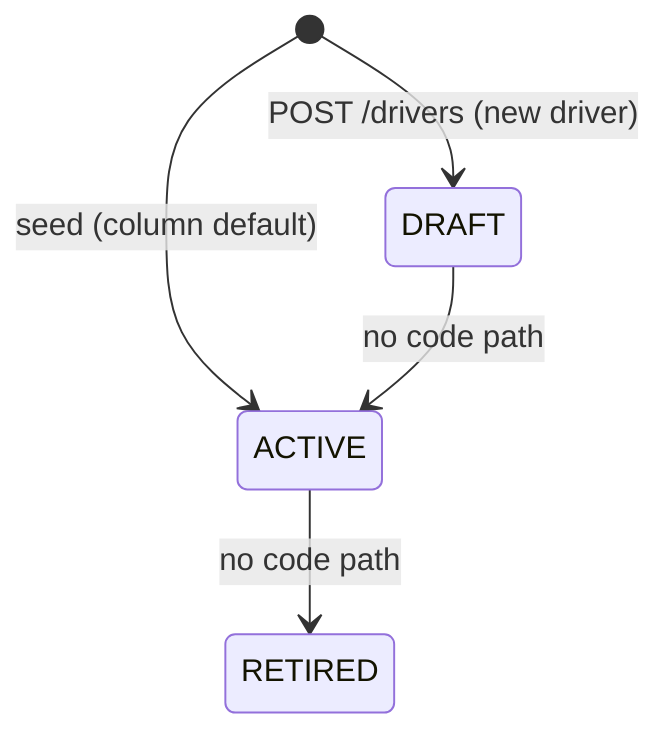

**Rules:**
- **Only ACTIVE drivers can be shocked:** both the question-driven desk and the workflow only accept ACTIVE drivers within their effective dates.
- **Only fixed-value drivers, from a question:** the desk needs the driver's formula to be a single number (e.g. `utilisation = 0.75`) — a computed driver like `heads` is refused, with a reason given.
- **Re-saving a driver keeps its status:** posting to an existing driver updates its formula, not its status.

---

## 11. `scenario_set` (fpa_governance)

The scenarios of a plan: `base`, `stretch`, `downside`. **Branches, not copies:** only `base` has lines in `plan_version_line`; `stretch` and `downside` are defined by their `scenario_driver_override` rows.

| Scenario | Seeded overrides | Lines in the governance store |
|---|---|---|
| `base` (`is_base`) | none | yes — the only scenario with lines |
| `stretch` | utilisation 0.78, rate_increase 0.05 | none; a line is refused by `plan_line_scenario_guard` |
| `downside` | utilisation 0.70, attrition 0.18 | none; a line is refused by `plan_line_scenario_guard` |

**Possible values of `state`:** CHECK `ck_scenario_set_state` ([004:75](../db/migrations/versions/004_create_plan_versions_and_scenarios.py#L75)). Starts as `DRAFT`.

| State | What it means | Who/what sets it |
|---|---|---|
| `DRAFT` | The default, and currently the only state reached in practice | Seeded (3 rows for PV-2026-0001) |
| `APPROVED` | — | **Reserved for future use — nothing sets it today** |
| `LOCKED` | — | **Reserved for future use — nothing sets it today** |

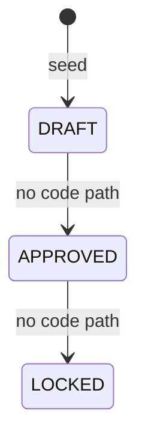

The branch's state column is not moved by anything yet: a branch is frozen with its plan version (its overrides belong to that version, and a LOCKED version's lines cannot change).

---

## One request, followed through every table

Run live on 2026-09-28 against the stack. Poland (RTPL1–3), Jul–Dec 2026, base scenario; utilisation had already been re-forecast to 0.73. The planner asks: *"Drop Poland utilisation to 72% and re-run the second half."* Only RTPL1 has lines bound to utilisation in H2, so the dirty set is 1,034 base lines (3,102 staged across the three scenarios).

| Step | `reforecast_request` | `plan_version` R5 | `covenant_check` | `plan_approval` | `recompute_run` state | `plan_publication` rev 5 | `commitment` | Cube `fact_plan_line` |
|---|---|---|---|---|---|---|---|---|
| Planner asks (agent drafts) | **PROPOSED** (0.73 → 0.72, PL, 2026-07..12) | – | – | – | – | – | – | Poland H2 at rev 3 |
| Planner confirms | RUNNING | created **DRAFT** | – | – | RUNNING | RESERVED | – | unchanged; new values only in `_staged` |
| Lines recomputed | **AWAITING_SUBMISSION** | DRAFT, 1,034 lines with traces | none yet | – | AWAITING_SUBMISSION | RESERVED | – | unchanged |
| Planner submits → system checks | AWAITING_CONTROLLER | **IN_REVIEW**, `covenant_ok` true (system) | 9 rows, all passed | PENDING | AWAITING_APPROVAL | RESERVED | – | unchanged |
| Controller approves | **AWAITING_CFO** | **APPROVED**, `approved_by` = controller | – | APPROVED | AWAITING_LOCK | RESERVED | – | unchanged |
| CFO locks → system publishes | PUBLISHING | **LOCKED** | – | APPROVED | PUBLISHING | PUBLISHED | – | **rev 5** live for Poland H2 |
| Commit, supersede, variance | **PUBLISHED** | LOCKED (R3 → SUPERSEDED) | – | APPROVED | **COMPLETED** | COMMITTED (rev 3 → SUPERSEDED) | 6 × RESERVED (rev 3's → RELEASED) | rev 5 |

Refused along the way, each leaving the run parked: the controller or CFO acting before submission (the API: "the run is at AWAITING_SUBMISSION"), the planner approving their own plan (segregation of duties), the controller locking (needs the cfo role), a controller writing the successor's covenant by hand (migration 023). With the worker container stopped, the controller's approval was still accepted and applied once the worker came back.

The audit log for R5, in order: `SUBMITTED` (planner) → `COVENANT_PASSED` (service) → `IN_REVIEW` (service) → `APPROVED` (controller) → `LOCKED` (CFO).

**When it breaches instead** (run live the same day): *"Cut Poland utilisation to 55% for the second half."* The planner confirms and reviews the lines, then submits:

| Table | Where it ends up |
|---|---|
| `covenant_check` | written on submission: GM 23.04% (needs ≥ 30) and revenue −14.9% (limit −5) fail in all 3 scenarios; cost passes (6 of 9 failed) |
| `reforecast_request` | **COVENANT_FAILED**, closed |
| `plan_version` R4 | DRAFT → **REJECTED** (system), closed; never IN_REVIEW |
| `plan_approval` | none — no controller was ever asked |
| `recompute_run` | REJECTED, detail `COVENANT_BREACH: …` |
| `plan_publication` rev 4 | stays RESERVED; its staged rows are deleted |
| `commitment` / cube | untouched |

---

## Status fields that aren't stored in a table

These are computed on the fly, not persisted as a state column (the one stored exception, `ask_history.status`, is only a write-once copy of an answer's result):

| Field | Values | Where |
|---|---|---|
| Progress `approval_state` | `NOT_YET`, `WAITING` (parked at any of the three gates), `DECIDED`, `CANCELLED` | [workflows.py](../src/fpa_project/recompute/workflows.py) |
| Run result `outcome` | `PUBLISHED`, `COVENANT_BREACH`, `REJECTED`, `EXPIRED`, `CANCELLED`, `COMPENSATED`, `NO_OP`, `ALREADY_PUBLISHED`, `ALREADY_<state>` | [workflows.py](../src/fpa_project/recompute/workflows.py), `RecomputeResult` |
| Agent answer `execution_status` | `SUCCESS`, `VALIDATION_ERROR`, `REJECTED_SCOPE`, `OUT_OF_SCOPE`, `AWAITING_APPROVAL`, `DRAFT`, `REFUSED`, `REFORECAST_PROPOSED` | [agent_team/models.py](../src/fpa_project/agent_team/models.py) |
| `ask_history.status` (stored, written once) | a copy of the answer's `execution_status` above, saved with each question; never changes afterwards | [ask_history.py](../src/fpa_project/ask_history.py), migration 024 |
| Re-forecast draft `status` (tool result) | `DRAFT`, `INVALID` | `ReforecastProposal` in [agent_team/models.py](../src/fpa_project/agent_team/models.py) |

## To see every state at once

```sql
SELECT plan_version_code, state, covenant_ok, requested_by, approved_by FROM fpa_governance.plan_version ORDER BY created_at;
SELECT request_id, state, driver_code, from_value, to_value, scope_label, requested_by, run_id FROM fpa_governance.reforecast_request ORDER BY created_at;
SELECT rule_code, scenario_code, measured_value, comparator, threshold, passed FROM fpa_governance.covenant_check ORDER BY checked_at DESC, rule_code;
SELECT rule_code, metric, measure, comparator, threshold, scope, active FROM fpa_governance.covenant_rule;
SELECT decision, requested_by, decided_by FROM fpa_governance.plan_approval;
SELECT state, phase, detail, started_at FROM fpa_governance.recompute_run ORDER BY started_at DESC;
SELECT revision, state, shocks FROM fpa_governance.plan_publication ORDER BY revision;
SELECT revision, scenario, category, state FROM commitment_service.commitment ORDER BY revision;
SELECT status, created_by FROM fpa_governance.variance_report ORDER BY created_at DESC LIMIT 10;
SELECT state, requested_by, decided_by FROM fpa_governance.agent_proposal;
SELECT driver_code, status FROM fpa_governance.plan_driver ORDER BY driver_code;
SELECT scenario_code, state FROM fpa_governance.scenario_set;
SELECT ask_id, user_id, status, created_at FROM fpa_governance.ask_history ORDER BY created_at DESC LIMIT 10;
```

---

## The whole flow in one picture

The question-driven path, start to finish: from the planner's words to committed budget. Each box names who acts and what changes, and in which table.

| Short name | Table |
|---|---|
| `request` | `fpa_governance.reforecast_request` |
| `plan_version` | `fpa_governance.plan_version` |
| `checks` | `fpa_governance.covenant_check` |
| `approval` | `fpa_governance.plan_approval` |
| `run` | `fpa_governance.recompute_run` |
| `publication` | `fpa_governance.plan_publication` |
| `commitment` | `commitment_service.commitment` |
| `report` | `fpa_governance.variance_report` |
| cube | ClickHouse `fpa_cube` tables |

```mermaid
flowchart TD
    subgraph P0["Before · the plan exists and is agreed"]
        Z1["<b>PV-2026-0001</b><br/>plan_version = APPROVED or LOCKED<br/>(authored with make plan-create / the API,<br/>then reviewed, approved and locked in the Plans tab)"]
    end

    subgraph P1["Part 1 · The planner asks"]
        A1["<b>Planner asks in words</b><br/>'drop Poland utilisation to 72%<br/>and re-run the second half'"]
        A2{"<b>Human planner</b><br/>with whole-model scope?"}
        A3["<b>Agent: read path</b><br/>DSL → compiler → cube<br/>(current Poland H2 figures)"]
        A4{"<b>propose_reforecast</b><br/>driver ACTIVE and fixed-value?<br/>country → companies, period → months<br/>in scope, in the plan year?"}
        A5["<b>Draft stored as the planner</b><br/>request = PROPOSED<br/>utilisation 0.74 → 0.72, RTPL1-3, 2026-07..12"]
        AX["Agent explains why;<br/>nothing stored"]
        A1 --> A2
        A2 -- "no: no tool, answer only" --> AX
        A2 -- "yes" --> A3 --> A4
        A4 -- "invalid" --> AX
        A4 -- "valid" --> A5
    end

    subgraph P2["Part 2 · The planner confirms"]
        B1{"<b>Planner who asked</b><br/>confirms the agent's draft?"}
        BR["request = CANCELLED<br/><b>closed</b>"]
        B2["<b>Confirm</b><br/>request = RUNNING<br/>Temporal workflow starts"]
        B1 -- "withdraw" --> BR
        B1 -- "confirm" --> B2
    end

    subgraph P3["Part 3 · Recompute, planner review, covenant check"]
        C1["<b>SNAPSHOT</b><br/>publication rev N = RESERVED<br/>plan_version R&lt;N&gt; = DRAFT<br/>cube: baseline frozen"]
        C2["<b>RECOMPUTING</b><br/>only Poland Jul-Dec lines are read and rewritten<br/>base: plan_version_line (R&lt;N&gt;, with trace) + staged<br/>stretch / downside: staged only<br/>live fact_plan_line unchanged"]
        C5{"<b>AWAITING_SUBMISSION</b><br/>planner reviews the recomputed lines<br/>request = AWAITING_SUBMISSION"}
        C3{"<b>COVENANT_CHECK</b> (system only)<br/>covenant_rule × 3 scenarios<br/>on the submitted draft"}
        CF["<b>Breach</b><br/>checks: any passed = false<br/>plan_version R&lt;N&gt; DRAFT → REJECTED (closed)<br/>run = REJECTED (COVENANT_BREACH)<br/>request = COVENANT_FAILED (closed)<br/>staged rows deleted; no controller asked"]
        C4["<b>Pass</b><br/>checks: all passed = true<br/>covenant_ok = true (system)<br/>plan_version R&lt;N&gt; = IN_REVIEW<br/>approval = PENDING<br/>request = AWAITING_CONTROLLER"]
        C1 --> C2 --> C5
        C5 -- "submit" --> C3
        C3 -- "fail" --> CF
        C3 -- "pass" --> C4
    end

    subgraph P4["Part 4 · Controller approves, CFO locks"]
        D1{"<b>Controller decides</b><br/>sees checks, impact, lines<br/>(not the requester)"}
        D3{"<b>CFO decides</b><br/>(not the requester, not the approver)"}
        DR["<b>Rejected / declined / 72 h expired / cancelled</b><br/>plan_version = REJECTED<br/>request = CONTROLLER_REJECTED / CFO_REJECTED / EXPIRED / CANCELLED<br/>staged rows deleted; nothing published"]
        D2["<b>Approved</b><br/>approval = APPROVED<br/>plan_version R&lt;N&gt; = APPROVED (not locked, not published)<br/>request = AWAITING_CFO"]
        D4["<b>Locked</b><br/>plan_version R&lt;N&gt; = LOCKED<br/>request = PUBLISHING"]
        D1 -- "reject / timer / cancel" --> DR
        D1 -- "approve" --> D2 --> D3
        D3 -- "do not lock / timer / cancel" --> DR
        D3 -- "lock" --> D4
    end

    subgraph P5["Part 5 · Publish, then the Commitment Service"]
        E1["<b>PUBLISHING</b><br/>cube: old rows → preimage<br/>cube: staged → fact_plan_line (rev N live)<br/>publication = PUBLISHED"]
        E2{"<b>COMMITTING</b><br/>6 commitments<br/>(scenario × Revenue/Cost)"}
        E3["<b>Committed</b><br/>commitment × 6 = RESERVED<br/>publication = COMMITTED<br/>previous rev: commitments RELEASED, publication SUPERSEDED<br/>version it replaced: LOCKED → SUPERSEDED"]
        E4["<b>VARIANCE → DONE</b><br/>report = OPEN or ESCALATED<br/>run = COMPLETED<br/>request = PUBLISHED"]
        EC["<b>COMPENSATING</b><br/>commitments RELEASED, cube restored<br/>publication = COMPENSATED<br/>run / request = COMPENSATED"]
        E1 --> E2
        E2 -- "accepted" --> E3 --> E4
        E2 -- "service failed" --> EC
    end

    Z1 ==> A1
    A5 ==> B1
    B2 ==> C1
    C4 ==> D1
    D4 ==> E1
    CF -. "a different change is a new question" .-> A1
    DR -. "a different change is a new question" .-> A1
    BR -. "a different change is a new question" .-> A1
```

**Reading the picture:**

0. **Before anything:** the plan is already agreed: created through the API (`make plan-create`), then taken through the Plans tab (DRAFT → IN_REVIEW → APPROVED → LOCKED; a rejected plan stays rejected).
1. **Part 1:** only a human planner's agent can draft a request. It checks the words make sense, and saves the draft under the planner's name.
2. **Part 2:** the planner who asked confirms the agent understood; that starts the run. Nothing is approved by confirming.
3. **Part 3:** the worker recomputes just the slice that was asked about into a DRAFT. The planner reviews those lines and submits; only then does the system check every covenant. A breach rejects the draft right there, for good — no controller is asked.
4. **Part 4:** a pass reaches a controller, who approves or rejects. Approval does not lock or publish: the CFO, a different person, locks.
5. **Part 5:** once locked, the system publishes the numbers to the cube, and only then is the budget reserved. If reserving fails, the cube is put back the way it was.
