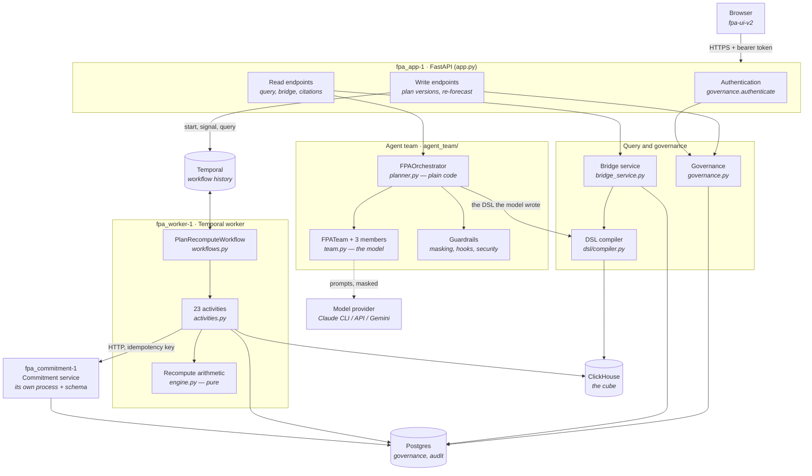
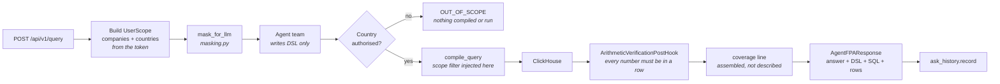
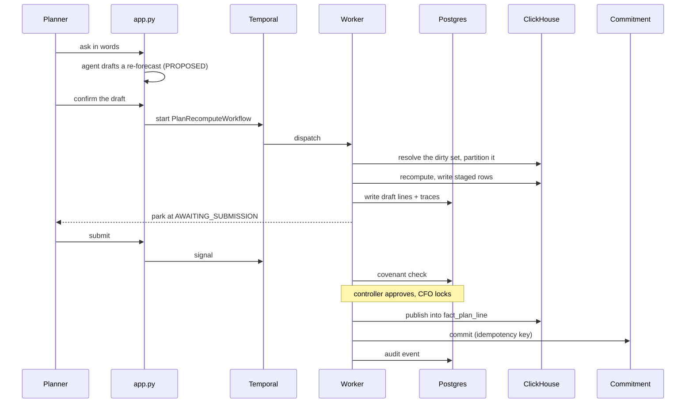
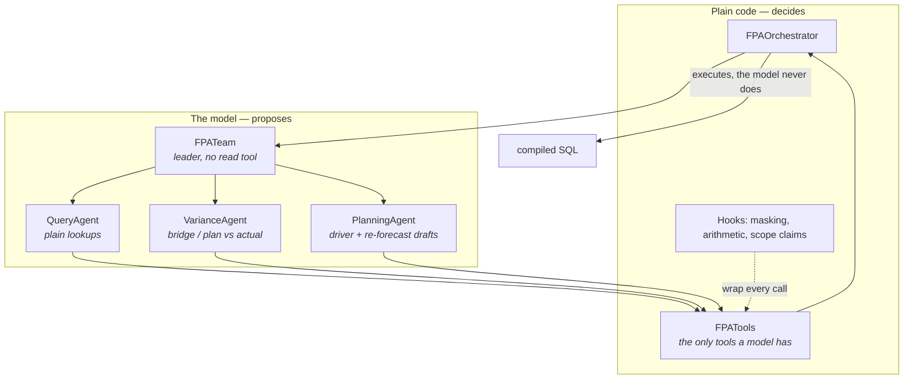

# Component diagram: the backend

What the backend is made of, which part talks to which, and where each boundary
sits. [ARCHITECTURE.md](ARCHITECTURE.md) gives the design reasoning; this file
shows the component boundaries.

One rule explains most of the shape: **the model proposes, the compiler
decides, the database enforces.** Every arrow below either carries a proposal
or crosses a boundary that checks one.

---

## 1. The whole backend

Three processes of our own, three backing services. The three share one image
and one codebase; what each becomes is decided by `FPA_ROLE` and the command it
is started with.

**What the picture is saying.** The browser only ever reaches `app.py`. The
model only ever reaches the cube through the compiler. The worker is the only
thing that writes recomputed plan lines, and it reaches the downstream
commitment service over HTTP rather than sharing a transaction with it — so a
failure there is a visible failure, not a silent rollback.

---

## 2. The read path

A question comes in; an answer with evidence goes out. Nothing changes.

Three checks sit on this path, and none of them is the model's to make:

| Check | Where | What it stops |
|---|---|---|
| Entity scope | `compiler.py`, inside the SQL | A model widening its own access |
| Country authorisation | `planner.py`, before compiling | Answering `0.00` for a country you cannot see |
| Arithmetic | `hooks.py`, after execution | A number that is not in any returned row |

---

## 3. The write path

An assumption changes, the plan is recomputed, three systems move together.

The worker can die at any point here. The state lives in Temporal's history,
not in the process, so a restart resumes from the last completed partition
rather than starting over.

---

## 4. Inside the agent team

The part most worth understanding, because it is where the trust boundary is.

The leader holds **no read tool**, so a question it cannot answer alone has to
be delegated — which is what puts a named member in the trace.
`propose_reforecast` is only registered when the caller is a human planner, so
for anyone else the tool does not exist and the model cannot attempt it.

---

## 5. Component reference

| Component | Module | Depends on | Owns |
|---|---|---|---|
| API | `app.py` | everything below | HTTP, auth dependencies, request shapes |
| Agent orchestrator | `agent_team/planner.py` | tools, hooks, compiler | What runs, what is refused, retries |
| Agent team | `agent_team/team.py` | model provider | Turning intent into DSL |
| Agent tools | `agent_team/tools.py` | compiler, schema | The only surface a model can call |
| Guardrails | `agent_team/{masking,hooks,security}.py` | — | PII, injection, arithmetic, scope claims |
| DSL compiler | `dsl/compiler.py` | schema, ClickHouse | **The security boundary.** Parameterised SQL, scope filter, vintage pinning, row budget |
| Bridge | `bridge_service.py` | compiler, `dsl/bridge.py`, Postgres | Variance decomposition, reports, citations |
| Governance | `governance.py` | Postgres | Identity, roles, plan state machine, audit chain |
| Countries | `countries.py` | — | Code ↔ name, and what a query asks for |
| Re-forecast client | `recompute/client.py` | Temporal | Start, signal, query, cancel |
| Workflow | `recompute/workflows.py` | activities | Order of events; no I/O, no clock, no randomness |
| Activities | `recompute/activities.py` | Postgres, ClickHouse, commitment | Every read and write, retried individually |
| Recompute engine | `recompute/engine.py` | — | The arithmetic, pure and testable |
| Commitment | `commitment/service.py` | its own Postgres schema | The downstream counterparty |

---

## 6. Where the boundaries are

Four lines in this system are worth naming, because crossing one is always a
deliberate act:

1. **Browser → API.** A bearer token, hashed and looked up. Scope comes from
   the token; a request body can narrow it and never widen it.
2. **Orchestrator → model.** Everything sent is masked first. Whatever comes
   back is a *proposal*, checked before it is used.
3. **Compiler → ClickHouse.** The only place SQL is produced. Literals are
   bound as parameters, the scope filter is added here, and the read is pinned
   to a ledger vintage.
4. **Worker → commitment service.** HTTP, with an idempotency key, to a
   separate process and schema. No shared transaction, so a downstream failure
   cannot be hidden by a rollback.
